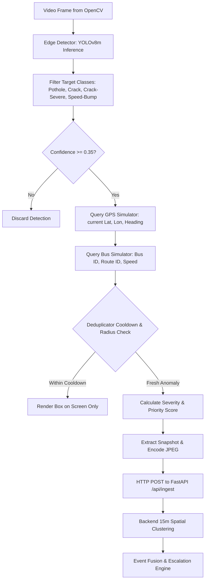

# Event Engine & Edge/Backend Processing Logic

This document specifies the edge pipeline and the backend Event Intelligence Layer for the SIH26124 MVP.

---

## 1. Frame-to-Event Processing Pipeline

---

## 2. Supported Anomaly Classes
The edge detector and backend actively identify and track:
1. `Pothole`
2. `Crack`
3. `Crack-Severe`
4. `Speed-Bump`

---

## 3. Deduplication & Spatial Clustering Parameters

### Edge-Level Physical Anomaly Tracking (ByteTrack)
- **Multi-Object Tracking Engine**: `supervision.ByteTrack` with class partitioning.
- **Track Activation**: `track_activation_threshold = 0.30`
- **Track Persistence**: `lost_track_buffer = 30` frames (1.0s at 30fps) with Kalman filter motion prediction.
- **Minimum Matching Threshold**: `0.80` (empirically validated as optimal balance).
- **Minimum Hits Validation**: `min_hits = 2` (requires at least 2 detection frames to filter transient noise).

### Post-Tracker Motion-Compensated Track Stitcher (`edge/track_stitcher.py`)
- **Objective**: Heals gap-based fragmentation caused by brief detection dropouts without altering ByteTrack frame-to-frame association.
- **Scope**: Gap-separated sequential fragments of the same class (`first_frame_idx > last_frame_idx`). Concurrent/temporally overlapping fragments are strictly excluded to avoid false merges.
- **Evidence-Based Matching Gates**:
  1. Class identity match.
  2. Temporal gap constraint: $0 < \text{gap} \le 15$ frames.
  3. Extrapolated spatial distance: $\min(\text{pred\_dist}, \text{raw\_dist}) \le 25.0\text{ px}$.
  4. Directional alignment: $\cos(\mathbf{v}_1, \mathbf{v}_2) \ge 0.40$ when motion is measurable ($|\mathbf{v}| > 0.01\text{ px/f}$).
  5. Chain validation: Merged tracks sequentially re-evaluate combined trajectory for any subsequent chaining.
- **Event Dispatch Contract**: One edge event per completed physical anomaly track, retaining the highest-confidence frame observation, bbox, GPS coordinate, and severity score.
- **Distinction**: Repeated detections and gap-fragmented tracks of the same defect collapse into 1 event; distinct simultaneous or sequential anomalies maintain distinct persistent tracks and emit distinct events.

### Backend-Level Spatial Clustering
- **Radius**: 15 meters (`calculate_haversine_meters`).
- **Matching Rule**: Incoming detection is correlated with an open (non-`RESOLVED`) incident matching the same `anomaly_type`.
- **Duplicate Observation Suppression**: Rapid frames from the same bus within 2.0 seconds update `last_detected_at` without duplicate observation entries.
- **Centroid Update**: Moving average recalculates defect coordinates across all observations.

---

## 4. Rule-Based Severity Engine & Priority Scoring

The backend employs a transparent, configurable rule-based severity and priority system (`backend/app/services/severity.py`):

### Baseline Confidence Thresholds
- **HIGH**: $\text{confidence} \ge 0.85$
- **MEDIUM**: $0.65 \le \text{confidence} < 0.85$
- **LOW**: $\text{confidence} < 0.65$

### Priority Score Formulation (0 to 100)
1. **Base Class Score**:
   - `Pothole`: 70 points
   - `Crack-Severe`: 55 points
   - `Crack`: 30 points
   - `Speed-Bump`: 20 points
2. **Confidence Factor**: $\text{score} = \text{base\_score} \times \text{confidence}$.
3. **Repeated Observation Bonus**: If $\text{confirmation\_count} \ge 3$, adds $+10$ points.
4. **Multi-Bus Verification Bonus**: If $\text{unique\_bus\_count} \ge 2$, adds $+15$ points.
5. **Clamping**: Clamped strictly between $0$ and $100$.

---

## 5. Multi-Bus Confirmation & Severity Escalation

When the backend correlates incoming observations:
- Recalculates $\text{unique\_bus\_count} = \text{count}(\text{distinct } \text{bus\_id})$.
- If $\text{unique\_bus\_count} \ge 2$:
  - The incident severity **escalates by one tier**:
    $$\text{Low} \longrightarrow \text{Medium} \longrightarrow \text{High} \longrightarrow \text{Critical}$$
  - Capped strictly at **Critical**.
  - Automatically advances status from `NEW` to `VERIFIED` if currently in `NEW`.
  - Records an audit log entry in `StatusHistory`.

---

## 6. Status Workflow & History Tracking

### State Machine Lifecycle
$$\text{NEW} \longrightarrow \text{VERIFIED} \longrightarrow \text{ASSIGNED} \longrightarrow \text{IN\_PROGRESS} \longrightarrow \text{RESOLVED}$$

### Transition Rules
- `NEW`: Can transition to `VERIFIED`, `ASSIGNED`, `IN_PROGRESS`, `RESOLVED`.
- `VERIFIED`: Can transition to `ASSIGNED`, `IN_PROGRESS`, `RESOLVED`.
- `ASSIGNED`: Can transition to `IN_PROGRESS`, `RESOLVED`.
- `IN_PROGRESS`: Can transition to `RESOLVED`.
- `RESOLVED`: Terminal state (rejects backward transitions to prevent unauthorized reopenings without administrative action).

Any illegal transition returns HTTP `400 Bad Request`. Every state transition is recorded in `status_history` table with timestamps and contextual notes.
